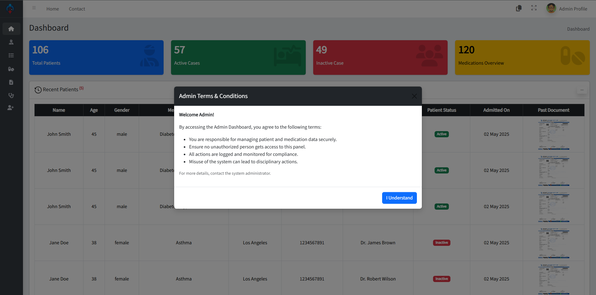
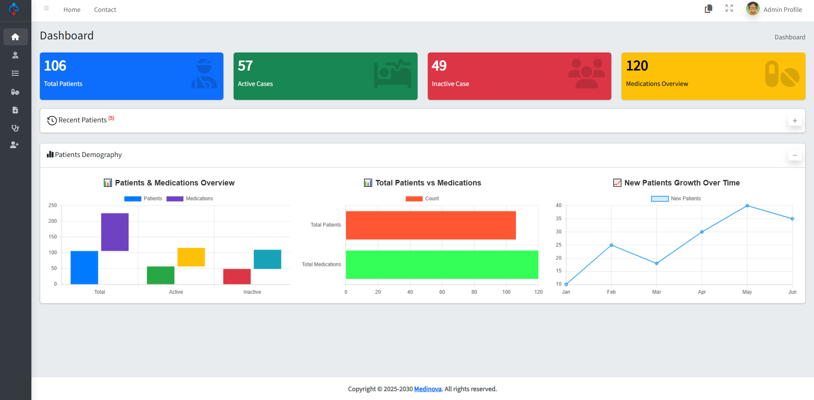
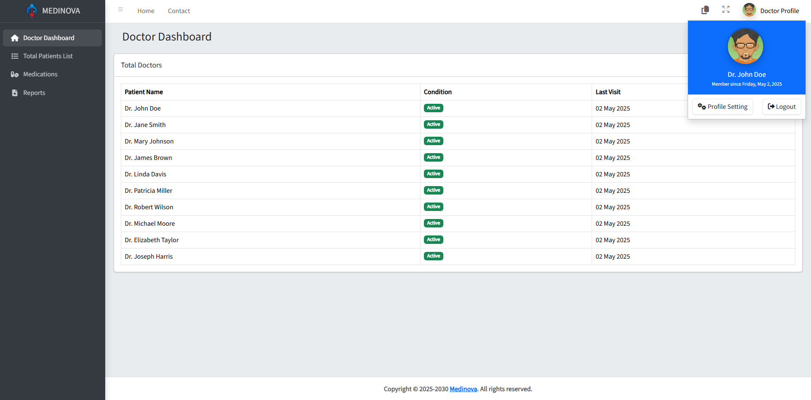
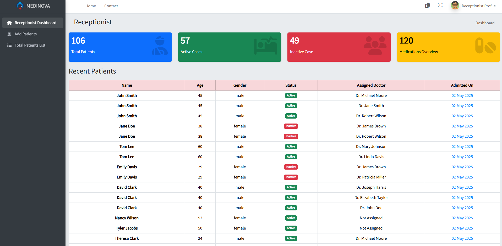
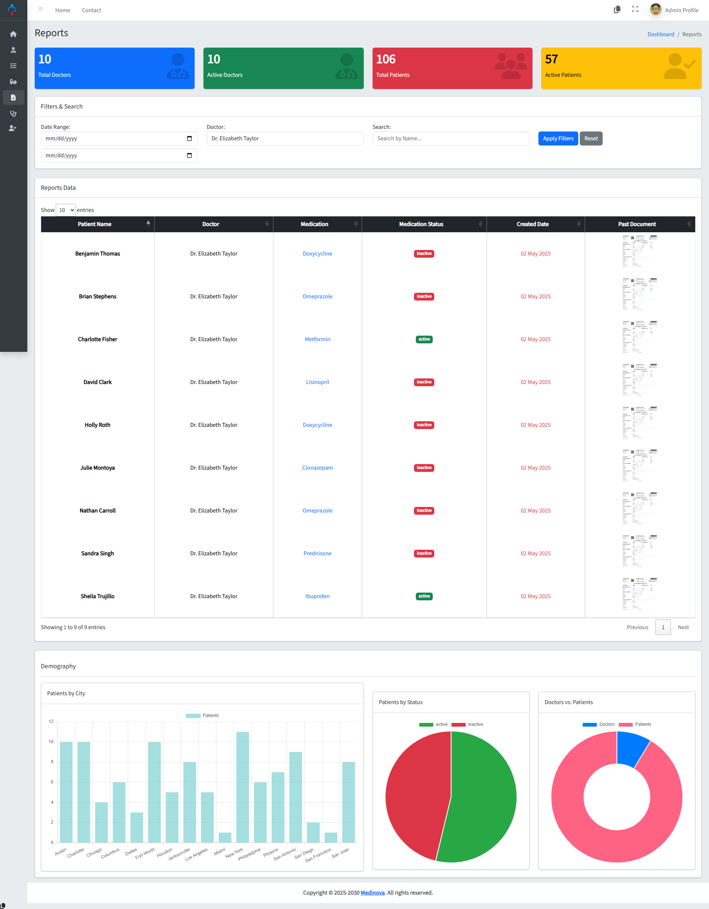

<div style="text-align: center;">


# PRMS — Patient Record Management System

**Medinova** | Lightweight Hospital & Clinic Management System

</div>

---

## 📋 Table of Contents
- [Overview](#overview)
- [Features](#features)
- [Tech Stack](#tech-stack)
- [Quick Start](#quick-start)
- [Installation](#installation)
- [Default Accounts](#default-accounts)
- [Screenshots](#screenshots)
- [Configuration](#configuration)
- [Troubleshooting](#troubleshooting)
- [Support](#support)

---

## 🏥 Overview

**PRMS** (Patient Record Management System) is a lightweight, production-ready hospital and clinic management system. It provides:

✅ **Public Marketing Frontend** — Bootstrap-based home, about, services, and contact pages  
✅ **Role-Based Admin Panel** — Dedicated interfaces for Admin, Doctor, and Receptionist roles  
✅ **Complete Patient Management** — Add, edit, delete, and track patient records with document uploads  
✅ **Medication Tracking** — Manage prescriptions with dosage, frequency, and doctor assignments  
✅ **Analytics Dashboard** — Real-time stats and Chart.js visualizations  
✅ **Pre-Seeded Database** — Ready-to-use sample data for immediate testing

---

## ✨ Features

### Admin Panel
- 🔐 Multi-role authentication (Admin, Doctor, Receptionist)
- 👥 User management with role assignments
- 🏥 Patient records with image/document uploads
- 💊 Medication database with prescribing details
- 📊 Dashboard analytics with Chart.js visualizations
- 🔍 Advanced search and filter functionality
- 📋 Comprehensive reporting tools

### Public Frontend
- 📱 Fully responsive Bootstrap design
- 🎠 Owl Carousel image sliders
- ✉️ Contact form integration
- 📄 Service and about pages
- 🔐 Secure login portal

---

## 🛠️ Tech Stack

| Layer | Technology |
|-------|-----------|
| **Backend** | PHP (Procedural) |
| **Database** | MySQL / MariaDB |
| **Frontend** | HTML5, CSS3, Bootstrap 5 |
| **Libraries** | jQuery, Chart.js, Owl Carousel, Tempus Dominus |
| **Server** | Apache (XAMPP) |

---

## 🚀 Quick Start

### Prerequisites
- Windows OS
- XAMPP (Apache + MySQL)
- Git Bash

### Clone & Setup (1 minute)
```bash
git clone https://github.com/SkillDevloper/PRMS-Patient-Record-Management-System-Medinova-.git PRMS
cd PRMS
```

Then follow the [Installation](#installation) steps below.

---

## 📥 Installation (Windows / XAMPP)

### Step 1: Install & Start XAMPP
1. Download [XAMPP](https://www.apachefriends.org/)
2. Install and start **Apache** and **MySQL** services

### Step 2: Clone Repository
```bash
git clone https://github.com/SkillDevloper/PRMS-Patient-Record-Management-System-Medinova-.git PRMS
```

### Step 3: Place in XAMPP
Copy the `PRMS` folder to:
```
C:\xampp\htdocs\PRMS
```

### Step 4: Import Database
Open Git Bash in the project folder and run:
```bash
mysql -u root -p prms_db < "Database File/prms_db.sql"
```
When prompted, press Enter (default password is empty).

### Step 5: Configure Database Connection
Edit `admin/config.php`:
```php
$servername = "localhost";
$username = "root";
$password = "";  // Leave empty if XAMPP default
$dbname = "prms_db";
```

### Step 6: Set File Permissions
Right-click `uploads/` folder → Properties → Security → Edit → Full Control (for SYSTEM user)

### Step 7: Access the Application
| URL | Purpose |
|-----|---------|
| `http://localhost/PRMS/` | Public website |
| `http://localhost/PRMS/admin/` | Admin login panel |

---

## 🔑 Default Accounts

| Role | Email | Password | Access |
|------|-------|----------|--------|
| **Admin** | `admin@gmail.com` | `123` | Full system access |
| **Doctor** | `doc@gmail.com` | `123` | Patient records & reports |
| **Receptionist** | `rec@gmail.com` | `123` | Front-desk operations |

> ⚠️ **Security Warning**: Passwords are MD5 hashed in seed data. For production, implement `password_hash()` and `password_verify()` functions.

---

## 📸 Screenshots

| Preview | Screen Name | Description |
|:-------:|:-----------|-------------|
|  | **Home Page** | Landing page with service highlights and hospital info |
|  | **About Us** | Facility information and medical mission statement |
|  | **Login Portal** | Secure authentication for all user roles |
|  | **Registration** | New user account creation |
|  | **Admin Dashboard** | System overview with analytics and statistics |
|  | **Records Management** | Patient and medication database interface |
|  | **Doctor Portal** | Patient diagnosis and medical history |
|  | **Receptionist Portal** | Scheduling and patient check-in interface |
|  | **Profile Settings** | User account and security preferences |
|  | **Reports** | Data visualization and clinical analytics |
|  | **Terms & Conditions** | Legal policies and user agreements |

---

## ⚙️ Configuration

### Database Credentials
Edit `admin/config.php`:
```php
define('DB_SERVER', 'localhost');
define('DB_USER', 'root');
define('DB_PASS', '');
define('DB_NAME', 'prms_db');
```

### File Uploads
Patient documents and profile pictures are stored in `uploads/` folder. Ensure:
- Folder exists and is writable
- Regular backups are maintained
- Max upload size configured in `admin/config.php`

### Branding
- Replace `img/logo.png` with your hospital logo
- Update hospital name in page headers
- Customize colors in `css/style.css`

---

## 🐛 Troubleshooting

| Issue | Solution |
|-------|----------|
| **"Database Connection Failed"** | Check `admin/config.php` credentials and verify MySQL is running |
| **"Upload Failed"** | Right-click `uploads/` → Properties → Security → Allow write permissions |
| **"Blank Pages / Parse Errors"** | Enable `display_errors` in `php.ini` and check Apache error logs |
| **"404 on Admin Pages"** | Ensure `mod_rewrite` is enabled in Apache (`httpd.conf`) |
| **"Login Not Working"** | Clear browser cache and verify `prms_db` table has seed data |

---

## 📁 Project Structure

```
PRMS/
├── admin/                    # Admin panel PHP files
│   ├── config.php           # Database configuration
│   ├── dashboard.php        # Admin dashboard
│   ├── patients.php         # Patient management
│   ├── medications.php      # Medication management
│   └── includes/            # Reusable components
├── Database File/
│   └── prms_db.sql          # Full schema + seed data
├── css/                     # Stylesheets
├── js/                      # JavaScript libraries
├── img/                     # Images & logo
├── lib/                     # Third-party libraries
├── uploads/                 # User uploaded files
├── index.html               # Home page
├── about.html               # About page
├── service.html             # Services page
├── contact.html             # Contact page
└── README.md                # This file
```

---

## 💡 Usage Tips

- **First Login**: Use default accounts to explore the system
- **Patient Records**: Upload ID/Medical documents for each patient
- **Backups**: Regularly backup `uploads/` folder and database
- **Reports**: Use the Reports page for patient statistics and analytics
- **Security**: Change default passwords immediately in production

---

## 📞 Support & Contact

- **Issues**: Report bugs on [GitHub Issues](https://github.com/SkillDevloper/PRMS-Patient-Record-Management-System-Medinova-/issues)
- **Email**: Contact the development team for support
- **Documentation**: Detailed guides in this README

---

## 📝 License

This project is open-source and available under the MIT License.

---

## 🤝 Contributing

Contributions are welcome! Please:
1. Fork the repository
2. Create a feature branch (`git checkout -b feature/AmazingFeature`)
3. Commit changes (`git commit -m 'Add AmazingFeature'`)
4. Push to branch (`git push origin feature/AmazingFeature`)
5. Open a Pull Request

---

**Made with ❤️ for Patient Care & Hospital Management**
